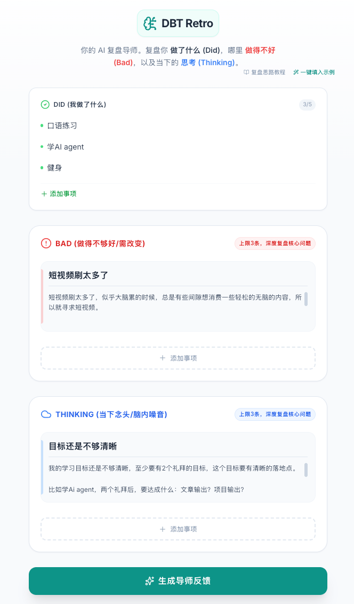
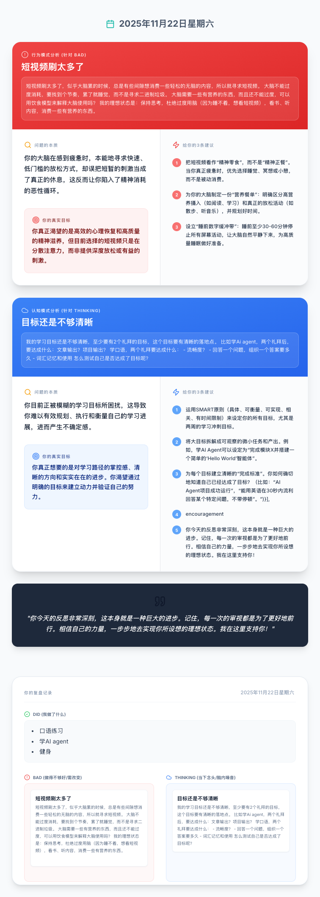

# DBT Retro - 你的 AI 复盘导师

**DBT Retro** 是一个基于 **Did / Bad / Thinking** 框架的深度复盘工具。它不仅仅是一个记录工具，更内置了基于 Gemini 2.5 模型的 AI 导师，能够针对你复盘中的痛点（Bad）和困惑（Thinking）进行深度剖析，挖掘问题本质，并给出可落地的行动建议。




## 核心理念 (The Framework)

本产品采用 **DBT 复盘法**，将复盘内容分为三个维度：

1. **Did (做了什么)**
    * 像 To-do List 一样的清单。
    * **作用**：为 AI 提供背景上下文，了解你的工作/生活负荷。
    * *注意：此部分仅作为背景，AI 不会对其进行深度分析。*

2. **Bad (做得不够好/需改变)**
    * **定义**：主要针对行为层面的问题（如：刷视频太久、晚睡、情绪失控）。
    * **结构**：核心问题 (Title) + 详细描述 (Description)。
    * **AI 分析**：AI 会挖掘行为背后的心理机制。

3. **Thinking (当下念头/脑内噪音)**
    * **定义**：主要针对认知层面的困惑（如：目标不清晰、焦虑、自我怀疑）。
    * **结构**：核心念头 (Title) + 详细描述 (Description)。
    * **AI 分析**：AI 会分析你的认知模式并提供突破点。

## ✨ 主要功能

* **结构化输入**：引导用户按照 D/B/T 结构清晰梳理思绪。
* **AI 深度剖析**：
  * **问题的本质 (The Essence)**：直击痛点，不留情面但充满关怀。
  * **真实目标 (True Goal)**：挖掘你潜意识里真正想要满足的需求。
  * **3 条核心建议**：给出具体、可执行的行动指南。
* **一键填入示例**：快速体验复盘流程。
* **复盘卡片导出**：
  * 支持一键下载 3 张高清图片：
        1. 完整报告 (Full Report)
        2. 仅 AI 分析 (Analysis Only)
        3. 仅用户复盘 (User Reflection)
* **极简设计**：基于 Tailwind CSS 的清爽 UI，专注于思考本身。

## 🛠️ 技术栈

* **Frontend**: React 18, TypeScript, Vite
* **Styling**: Tailwind CSS, Lucide React (Icons)
* **AI**: Google GenAI SDK (Gemini 2.5 Flash)
* **Tools**: html-to-image (截图生成)
* **Deployment**: Vercel

## 🚀 快速开始

### 1. 克隆项目

```bash
git clone https://github.com/your-username/dbt-retro.git
cd dbt-retro
```

### 2. 安装依赖

```bash
npm install
```

### 3. 配置环境变量

你需要从 [Google AI Studio](https://aistudio.google.com/) 获取 API Key。

在项目根目录创建 `.env` 文件（或者在 Vercel 部署时配置环境变量）：

```env
# 注意：根据 Vite 配置，你可能需要通过 vite.config.ts define 或者 import.meta.env 来使用
API_KEY=your_gemini_api_key_here
```

### 4. 启动本地开发

```bash
npm run dev
```

打开浏览器访问 `http://localhost:5173`。

## 📦 部署 (Vercel)

本项目已配置好 `vercel.json`，可直接一键部署：

1. 将代码推送到 GitHub。
2. 在 Vercel 面板中 Import 项目。
3. 在 Vercel 的 **Environment Variables** 中添加 `API_KEY`。
4. 点击 Deploy。

## 📚 教程与资源

* **复盘思路教程**: [点击阅读](https://www.believed-breadfruit.top/2025/11/22/2025-11-22-%E4%B8%80%E4%B8%AAai%E6%9E%81%E7%AE%80%E5%A4%8D%E7%9B%98%E6%80%9D%E8%B7%AF/)
* **作者小红书**: [关注我](https://www.xiaohongshu.com/user/profile/5d17984f0000000012021c90)

## License
